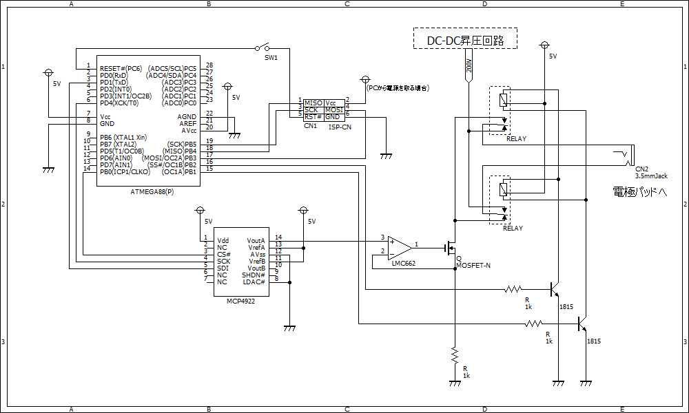
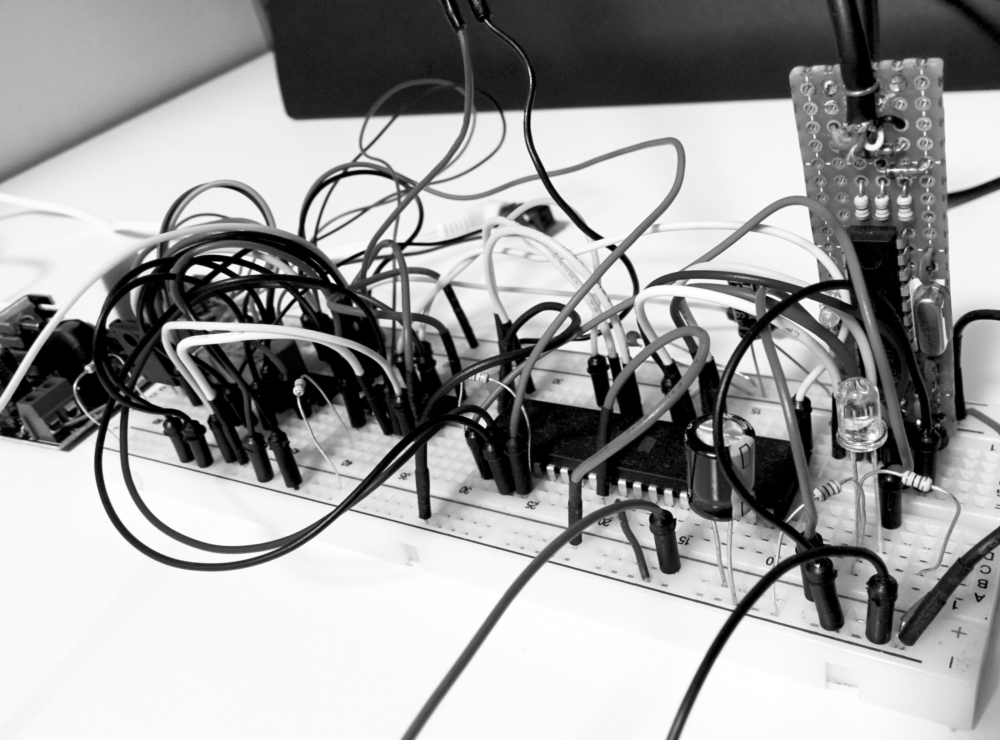
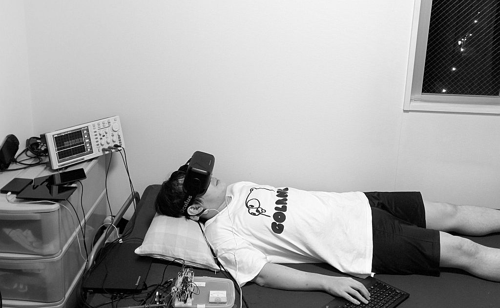

Title: オフトゥンでスヤァしながら加速度体験ができる秘密のデバイス
Subtitle: 電子工作＋バーチャル・リアリティ(仮)
Author: @binzume
Author(romaji): binzume

# オフトゥンでスヤァしながら加速度体験ができる秘密のデバイス

　こんにちは，binzumeです．記事のタイトルはいつのまにか決められていました．今回は頭に電流を流して，バーチャルな加速度を感じて遊ぶ話を書きます．前庭電気刺激(GVS)とよばれる技術を用いて仮想空間上で擬似的な加速度を体感するための電子工作や簡単なアプリを開発するという内容です．

　最近，会社で電子工作同好会という同好会を作ったので，久しぶりに何か作るかと思い立ちました．ネタ自体はしばらく温め続けていたものですが，やっと行動に移しました．今回こそは何かためになる真面目な記事を書こうと思っていたのですが，ネタに走ってしまいました．

※ この記事を読んだ結果生じたいかなる損害に対しても責任は負えません．特に電気の事故は生命に関わる場合もあるため，よく理解した上で遊びましょう．十分気をつけて自分の責任で行って下さい．

## 仮想世界と加速度

TODO:文章直す

　Oculus Riftで遊んでいると気持ち悪くなることがあると思いますが，原因の一つとして視覚として入力される風景の動きと身体が感じる感覚が一致しないことがあります．特にVR空間内で移動して視点が変わるが，実際の身体が動いてないという場合はどうしても違和感があります．
解決する方法の一つとして，実際に身体を動かしてそれをポジショントラッキングで認識したり，外部から加速度や振動などを与える設備を用意することがあげられると思います．

前者はOclus Rift DK2がカメラによるポジショントラッキングをサポートしています．後者も簡単ではありませんが多くの方が試みています．

実際に身体を動かす系．

超会議2015の展示とか．

楽しそう．

筆者も，スマートフォンのセンサを使ったポジショントラッキングを試みて，部屋の中を歩きまわったりしていました．

http://qiita.com/binzume/items/3bbca6ab8a7926fc7255


これはこれで楽しいのですが，ただ，何かが違うという思いがつきまといます．
必要なのは 仮想空間内での運動 と 感じる加速度が同期することであって，実際に身体を動かす必要は無いはずです．

ソードアート・オンライン第一話でナーヴギアをかぶったキリトくんが一人ベッドに横たわり「リンクスタート」する場面を思い返しましょう．

## 前庭電気刺激(GVS)

TODO:文章直す

前庭電気刺激というと聞きなれない言葉かも知れませんが，古くから知られている現象です．

人間の内耳内には，加速度を知覚し平衡感覚を司る前庭という組織があります．角速度を感じる三半規管に接しています．

前庭に1～2mAの電流を流すと平衡感覚が狂い架空の加速度を感じます．電流の向きで加速度の方向はコントロールできることも知られています．

頭に電流を流して感覚を操作するというと高度な何かに聞こえますが，電流を流すことは簡単な回路で実現できるので作ってみることにします．

### ハードウェア

　人体の抵抗を測ってみると数十kΩあります．このうちの大半は皮膚の抵抗で，汗をかいているかや皮膚の厚さによって大きく変動します．数mAの電流を安定すため，100V以上の電圧で出力できる定電流電源が必要になります．残念ながら都合の良い電流源が無いご家庭もあると思うので，回路を自作します．

　なるべく簡単に作れて安価に済ませたいので，直流の昇圧回路を探したところAitendoでDC-DC昇圧回路キットを見つけました．出力は126-311Vなので調度良さそうです．電極どうしようか悩んだのですが，色々調べてみて(注: http://www.todesking.com/hitosinigaderu/ )低周波治療器の電極を使うことにしました．



　電源周りなどは省略した回路図ですが，簡単に説明します．DC-DC昇圧回路で昇圧した電源を，MOSFETとオペアンプで制御します．ここは典型的な定電流回路です．極性の切り替えは回路を単純にするためリレーで制御することにしました．リレーを使っているため極性の切り替えに数十msかかりますがほとんどの場合はこれで十分間に合います．回路図上ではリレーが２つありますが，昔買った詳細不明な2c接点ラッチングリレーがあったのでそれを使いました．

- AVR ATMEGA88 ([秋月](http://akizukidenshi.com/))
- D/Aコンバータ MCP4922 (秋月)
- MOSFET 2SK3234 (秋月)
- OPアンプ LMC662CN
- DC-DC昇圧回路 ([aitendo](http://www.aitendo.com/product/6872)) 
- オムロン 電極パッド ([Amazon](http://www.amazon.co.jp/dp/B0002ERMBE))
- 2c接点ラッチングリレー(5Vで動作するもの)

　LMC662CNはたまたま手元にあったものなので，5Vで動いてフルスイング出力のものであればなんでも良いです．MOSFETはゲート電圧が5V以下でONになるものにしてください．LMC662もMCP4922も2chですが今回は１系統しか使用していません．



　動作確認用にブレッドボードに仮組みしてみました．だいぶひどい見た目ですが動きます．写真ではATMEGA88ではなくATMEGA644が使われていますが，途中でMEGA88を壊してしまい予備が見当たらなかったため，余ってたMEGA644で代用中です．


### ソフトウェア

　AtmelのMEGA88でDACの制御や簡単な波形の生成を行いっています．MCP4922はSPI制御なので汎用性を考えなければマイコン等を使わないという手もありますが，単体で簡単な波形出力が出来たほうが動作確認が楽だったり，Bluetoothで接続したり出来るようにしたかったので，それなりに余裕を持ったスペックのマイコンを使っています．
　AVRにプログラムを書き込むプログラマをそのまま通信用に用いて，電流値を設定するコマンドラインツールも適当に書きました．とりあえずWindows用です．動作確認とデバッグ用に作ったものなので，実際に使うならシリアルインターフェイスにするかBluetooth接続できるようにする予定です．
　もしコードに興味があれば記事の最後に載せてあるGitHubのリポジトリを参照して下さい．

### 動作テスト

　人体で試す前に回路が正しく動作していることを確認します．定電流回路になっているため，なにも繋がずに電源を入れると電極には最大電圧の約200Vがかかっている状態になっています．回路がオープンになっていることを検出する仕組みが欲しいところですがひとまず実害はありません．
電流値を1mA程度に設定し，電極間に10kΩ程度の抵抗をつないで電圧を測ります．

```
  10V / 10kΩ = 1mA
```

　中学校で習うオームの法則です．この計算によれば電極間には10Vかかっていれば正常なはずです．指定する電流を2mAにすれば倍の電圧になります．抵抗値を変えても電流が一定になるように電圧が追従します．

　回路が正しく動いているようですがいきなり頭に電流を流すのは少しばかり怖いので，電極パッドを腕に貼って実験します．

　2mA程度のパルスを入れるとちょっとだけピリピリする感じがあり，もう少し電流を流すと腕の筋肉が意識に反して収縮します．正しく動いている場合は大丈夫そうです．しかし，慎重に作業していても試行錯誤しているうちに間違って大きな電流を流してしまうことは十分予想できます．
注意深く作業していてもうっかり感電することはあります．たぶん大事なので２度書きました．ハードウェア上の最大電流を流した場合どうなるかは確認しておきたいので，手っ取り早く電圧を制御しているFETの足をショートさせてみます．このとき金属のピンセットなどでショートさせる場合は，ピンセットを持った手に電流が流れないように絶縁に気をつけて下さい．特に右手に電極を貼って左手で作業している場合，左右の手の間に電流が流れるのでなるべく避けましょう．

　実際にやってみると，電流で筋肉が収縮するのに加え思ったより強い衝撃に驚いたため，咄嗟に腕を大きく動かしてしまい，配線に引っ張られて試作中だった回路が飛んできました．びっくりしましたが腕には感電での火傷などもなく大丈夫そうです．

　というわけで実際に安全かどうかは置いておいて，被害は許容範囲なので頭に電極をつないで前庭を刺激してみます．
派手に感電した直後なので，恐怖心が残ってますが耳の後ろ辺りに電極を貼ります．まだ電流を流してないのにドキドキするので電流恐怖症になったかと思いましたがすぐ収まりました．最初は慎重に0.5mAくらいから徐々に電流を増やしていきます．1mAくらいまでは特になにも感じませんが，1.5mAくらいになると身体が傾いたように感じます．話には聞いていても自分で体験してみると「おおぅ」と感動します．適当な信号を入力すると，世界が傾いて感じたり，グラグラ揺れたり，面白いです．ただし，どうしても気になる現象がありました．

　味がします

　いわゆる電気の味です．とりあえずということで矩形波を出力していたのですが，極性が切り替わるタイミングでピリピリとした感覚と口の中になんとみ言えない味が広がります．少し不安になったので，オシロスコープで出力される信号の矩形のエッジ部分を観察してみると，なんとなく予想はしていましたが電流が流れすぎています．どうやら口の中に電流が流れそれが味として感じられていたようです．あと，あとから気づきましたが，目をつぶっていると，視界が微かにチカチカ光ることにも気づきました．特に身体に異常はありませんが，健康に害がないことを祈ります．徐々に電流を増やした場合は気にならなかったので，矩形波をやめて滑らかに変化させることにします．

## アプリケーション

　Oculus Riftで仮想空間内のプレイヤーを操作するとそれに連動した加速度を感じられる簡単なゲームを作ろうと考えていましたが，この記事を書くまでに間に合いませんでした．
　スマホの加速度センサの信号を記録して，それを再生できるアプリを書きました．スマホのカメラで動画を撮っておくことで映像と加速度情報を同時に再生できます．スマホのカメラの画角の問題で品質はいまいちですが，電極をつないだ状態で映像をOculus Riftで表示すれば「それっぽい感じ」を味わえます．




## 課題

改良したい課題など．

### 1軸のみしか扱えない

　電極パッドを貼る位置を工夫することで，左右だけでなく前後や上下の感覚も(多少ですが)得られると思います．ただし，この回路は非絶縁なので複数用意して多軸対応を行おうとすると，ペアとなる電極とは別の電極間で電柱が流れてしまい正しく動作しません．これは回路の設計の問題なので比較的簡単に解決はできますし，入力を無線化した上で絶縁型の電源を利用すればこのままの回路でもよいでしょう．

### 大雑把な感覚しか与えられない

　傾いたり揺れたりという感覚は得られますが，かなり大雑把なものなので細かな動作まで反映させるのは難しそうなのと，常にかかっている重力加速度を打ち消すほどの大きな感覚も得られないので，例えば自由落下する感覚を再現することも現状のままでは不可能そうでした．また加速度は身体全体で感じるものなので，前庭だけごまかしても違和感はなくならないので，解決が難しい問題です．

### 角速度もどうにかしたい

　三半規管の内部はリンパ液で満たされ，その動きで角速度を知覚しています．リンパ液は電解液なので，例えば電流流しつつ強めの磁場を与えれば三半規管内のリンパ液を動かせないかとかとか．フレミングの法則でお馴染みのローレンツ力です．妄想ですが．

## まとめ

- 舐めなくても電気の味がする
- あまり複雑なことできないが，可能性感じる
- SAOのナーヴギアは結構遠い

前庭電気刺激での感覚の制御は制限はありますが，遊びとしてはとてもおもしろいです．

今は神経を選択的に刺激するには，頭に電極を刺すとかしかないのかもしれませんが，将来非侵襲で実現する技術が出てくることに期待したいです．
非侵襲であれば比較的気軽に色々出来ますし，研究が進むだろうなと考えています．

最初にも書きましたが，危険な遊びなので十分気をつけて，自分の責任で行って下さい．この記事を読んだ結果生じたいかなる損害に対しても責任は負えません．特に電気の事故は生命に関わる場合もあるため，よく理解した上で遊びましょう．

回路図や実験に使ったソースコードはGitHub上に置いておきます．

 https://github.com/binzume/gvs

### 参考文献

大阪大 前田研究室
http://www-hiel.ist.osaka-u.ac.jp/japanese/exp/gvs.html

todesking
http://www.todesking.com/hitosinigaderu/
低周波治療器の電極使うのはここからパクりました．回路も参考にしています．
