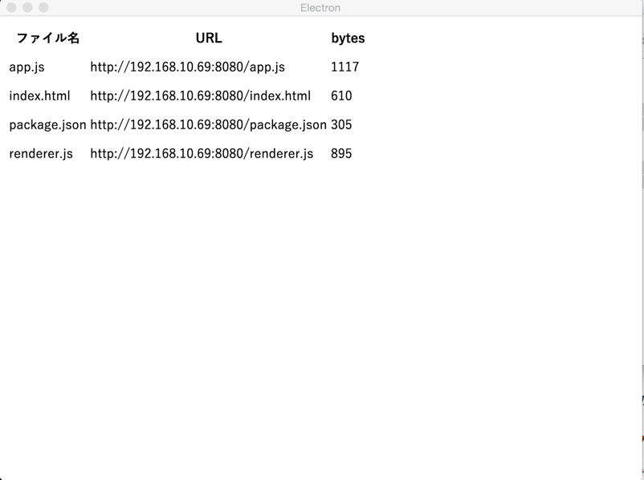

title: ElectronとRxでイマドキなアプリ
author: @erukiti_
author(romaji): erukiti

　はじめまして、erukitiと申します。みなさんはWindowsやMacで動作するデスクトップアプリケーションを書いたことがありますか？筆者は大昔にWin32APIとC言語を使って書いたことがありますが、開発やデバッグはそれなりに大変なものでした。時代は進んでウェブ技術を使って簡単にデスクトップアプリケーションを書けるようになりました。今回はElectronとRxという技術を使って簡単なアプリケーションを書いてみたいと思います。

## ウェブ技術でアプリを書けるElectron

　ElectronはGithub社がクロスプラットフォームで動くテキストエディタAtomを作るために公開されているフレームワークです。以前はAtom-Shellという名前でしたが、2015年4月23日にElectronという名前に変わりました。情報を検索するときに念頭に置いておくといいかもしれません。Electronは主にNode.jsとChromiumで構成されています。

　Node.jsはウェブブラウザとは独立したJavaScriptの処理系で、手元のコマンドラインでJavaScriptを動かすことができます。最近ではウェブ開発においても、いろいろなツールを必要とする点でNode.jsの重要性が増しているため、インストールしておいて損はないでしょう。もちろんElectronアプリケーションの開発においても必須です。また、ChromiumはGoogle社の開発しているオープンソースのウェブブラウザで、Chromeの母体となるものです。

* Electronで作られたアプリはクロスプラットフォームで動く (Windows, Mac, Linux)
* ウェブ技術(HTML+JavaScript)でアプリケーションを作る

## 環境整備

　Node.jsをインストールしていない方はまずはNode.jsをインストールしましょう。https://nodejs.org/ にアクセスして真ん中に輝くINSTALLのボタンを押してみてください。それぞれのOS(Windows,Mac,Liux)に応じたインストール用のファイルをダウンロードできるはずです。

　さて、Node.jsを使うためにはコマンドラインが必要です。Windowsの方は何らかのコマンドライン、MacやLinuxの方はお好みのターミナルを開いてみてください。以下はMacを前提に書きますが、Windows の人はいい感じに読み替えてみてください。

　うまく`node`コマンドが実行できればパッケージマネージャの`npm`もインストールされているはずです。作業ディレクトリに移動して初期化をしましょう。`npm init -y`を実行してauthor(あなたの名前)を入力すればパッケージをインストールできるようになります。electron-prebuilt, express, rxの三つのパッケージを作業ディレクトリにインストールしましょう。

```sh
$ node -e 'console.log("hello, world");'
hello, world
$ npm init -y
author: <あなたの名前>
$ npm install electron-prebuilt express rx --save
```

## ElectronでHello World.

　環境も整ったのでElectronでHello, Worldを表示するアプリケーションを書いてみたいと思います。まずは、Electronを起動するためのコードを書きます。ここではapp.jsというファイル名でコードを書きます。

```javascript
var app = require('app');
var BrowserWindow = require('browser-window');

app.on('window-all-closed', function() {
  app.quit();
});

var mainWindow = null;

app.on('ready', function() {
  mainWindow = new BrowserWindow({width: 800, height: 600});
  mainWindow.loadUrl('file://' + __dirname + '/index.html');
  mainWindow.on('closed', function() {
    mainWindow = null;
  });
});
```

　見ればなんとなくわかるかもしれません。`BrowserWindow`オブジェクトを生成することでElectronに内蔵されたChromiumのウィンドウが開かれ、`loadUrl`メソッドでapp.jsと同じディレクトリにあるindex.htmlが開かれます。このindex.htmlにはひとまずHello, World.とでも書いておきましょう。

　あとは、コマンドラインで`./node_modules/.bin/electron app.js`を実行すれば、Hello, world.と書かれた白いウィンドウが開くはずです。

### TIPS

* メニューの`View`から`Toggle Developer Tools`を開くか、`Command+Option+I`を押せば、Chromeと同じDeveloper Toolsを使用することができます。デバッグの便利なので是非とも使いこなしましょう。

## Rx (Reactive Extensions)

　Rxは非同期処理をコレクション操作と同じように書ける、FRP(関数語リアクティブプログラミング)を実現してくれるライブラリで、元々Microsoftが.Netで開発したもので今はMicrosoftやNetflixが様々な言語に移植しているもので、その中でもRxJSはRxのJavaScript版です。例えばこのプログラムは、画面をクリックしたら、コンソールにclickedと表示するプログラムです。

```javascript
Rx.Observable.fromEvent(document, "mouseup")
  .subscribe(function(ev) {console.log("clicked"))
```

## ストリーム・メッセージ・オペレータ

　Rxではデータの流れる一連の流れをストリームと呼びます。上記サンプルの`Rx.Observable.fromEvent(...)`で生成されるのがストリームで、このストリームにはマウスのボタンを放した時のイベントが流れます。`Rx.Observable.just(1, 2, 3)`ならば、1と2と3が流れるストリームです。このストリームに流れるデータをメッセージと言います。

　ストリームを`subscribe`すればメッセージを受信して、それに応じた処理を行うことができますが、単にマウスボタンのイベントを受信するだけでは物足りなく感じるところです。そこでオペレータと呼ばれる、メッセージを加工する処理を行ってみましょう。

```javascript
Rx.Observable.just("hoge", "fugapiyo")
  .map(function(s) {return s.length;})
  .subscribe(function(n) {console.log(n);)
```

　`map`オペレータは、メッセージを加工することができます。メッセージの文字列を、長さの数字に変換しているものです。

## Electron+Rx

　Rxについて概略を説明したところで、Electronのコードで実際にRxを使ってみましょう。まずは先ほどはHello, World.としか書かなかったindex.htmlを書き換えてみましょう。

```html
<!DOCTYPE html>
<html lang="ja">
  <meta charset="utf-8">
  <title>Electron</title>
  <body style="font-family: '游ゴシック', YuGothic, 'ヒラギノ角ゴ ProN W3', 'Hiragino Kaku Gothic ProN', Avenir, 'Helvetica neue', Helvetica, メイリオ, Meiryo, 'ＭＳ Ｐゴシック', serif;">
    <div id="test"></div>
    <script src="node_modules/rx/dist/rx.all.js"></script>
    <script src="renderer.js"></script>
  </body>
</html>
```

　ポイントは二つあって、htmlタグで`lang="ja"`を指定したことと、bodyタグのstyleにフォントファミリーを指定したことです。デフォルト状態では日本語をうまく処理してくれないので、langと日本語フォントを設定しないといけないのです。

　さて、次にrenderer.jsを書いてみましょう。ここではRxの簡単なコードを書いてみようかと思います。さきほどRxの説明にもあったマウスクリックにまつわる処理をここでは書いてみます。

```javascript
var clickStream = Rx.Observable.fromEvent(document, "mouseup");
var test = document.getElementById('test')
clickStream
    .buffer(clickStream.throttle(250))
    .map(function(x) {return x.length})
    .filter(function(n) {return n >= 2})
    .subscribe(function(n) {
      test.innerHTML = n + "clicks";
    });
```

　少し高度なRxのコードになってしまいました。250ミリ秒以内に二回以上クリックをした時に、`<div id="test">`に2clicksなどと表示するものです。

## イマドキのアプリ

　さて、Electron+Rxの説明が完了したところで、アプリを実際に作ってみましょう。今回作るのは、ファイルを気軽にローカルのウェブサーバーで公開できるというものです。

* アプリケーションを起動したらローカルでウェブサーバーが立ち上がる
* アプリケーションにドラッグ＆ドロップで貼り付けたファイルを公開する
* アプリケーションで表示されるファイル一覧からコピペしたURLを相手に教えると、そのURLからファイルをダウンロードできる

### ドラッグ＆ドロップを実現する

　まずはドラッグ＆ドロップを実装してみましょう。HTML5にはドラッグ＆ドロップの機能があって、例えば`document`オブジェクトの`drop`, `dragover`イベントをいじれば実装が可能です。

　renderer.jsを以下のコードに置き換えてみてください。ファイルをドラッグ＆ドロップすればコンソールにファイル名が出力されます。

```javascript
Rx.Observable.fromEvent(document, 'drop')
  .map(function(ev) {
    ev.preventDefault();
    return ev.dataTransfer.files;
  })
  .subscribe(function(files) {
    for (var i = 0; i < files.length; i++) {
      console.log(files.item(i).path);
    }
  });

Rx.Observable.fromEvent(document, 'dragover')
  .subscribe(function(ev) {
    ev.preventDefault();
  });
```

　`drop`イベントの`subscribe`に渡ってきた`files`は`FileList`オブジェクトですがこのオブジェクトは`length`メソッドでファイル数を数えることができ、`item`メソッドで個々のファイル情報を取得できます。ここではコンソールにファイル情報のパス名を出力しています。ちなみに`FileList`オブジェクトは配列との互換性はなく`for (file in files)`のような方法で個々のファイルを取り出すことはできません。

　ドラッグ＆ドロップ実装の注意点ですが、drop / dragover イベントをそれぞれpreventDefault()しないとChromiumの既存の動作として、ファイルがブラウザにそのまま出力されてしまいます。

## ローカルのウェブサーバー

　ドラッグ＆ドロップはいったん置いておいて、ローカルでウェブサーバーを立ち上げます。これはChromiumではなくNode.jsの機能です。expressという標準的なウェブサーバーのパッケージを使います。

```javascript
var express = require('express');

var appExpress = express();

appExpress.get('/app.js', function(req, res){
  res.download('app.js');
});
appExpress.listen(8080);
```

　`appExpress.get(URL, callback)`でURLにアクセスしたらcallbackが実行されます。callbackには`req`,`res`という二つのオブジェクトが渡されますが、`req`はリクエスト情報(アクセス方法など)、`res`はブラウザ情報を返すためのオブジェクトです。`res.download(path)`により、`path`のファイルをブラウザにダウンロードさせるという挙動を登録しています。

　`appExpress.listen(8080)`でウェブサーバーを8080ポートで立ち上げていますので、実際にブラウザに http://localhost:8080/app.js を打ち込んでみましょう。app.jsをダウンロードできたはずです。

## ドラッグ＆ドロップしたファイル名を伝える方法

　renderer.jsでドラッグ＆ドロップしたファイル名はどうやればexpressを立ち上げたapp.jsに伝わるのでしょうか。ここで重要なことですが、app.jsの動いているNode.jsとrenderer.jsの動いてるChromiumはそれぞれ別プロセスで動いているため、プロセス間通信を行う必要があります。app.js側をメインプロセス、renderer.js側をレンダラープロセスと言います。

```javascript
// メインプロセスから送信
mainWindow.webContents.send('hoge', 'fuga');

// レンダラープロセスで受信
ipc = require('ipc');
ipc.on('hoge', function(msg){
  console.log(msg);
});

// レンダラープロセスから送信
ipc.send('hoge', 'fuga');

// メインプロセスで受信
ipc.on('hoge', function(ev, msg) {
  console.log(msg);
});
```

　レンダラープロセスからパス名を送信して、メインプロセスで受信したら、そのパス名を使って`appExrepss.get`をすればいいわけですね。ここまでで、ドラッグ＆ドロップしたファイルをウェブで公開するというところまでは実現できました。

## URLを生成する

　画面が寂しいので、ドラッグ＆ドロップした時にファイル名・URLなどを表示したいと思いますが、少し足りない情報があります。それはURLの文字列のはじめの方でIPとポート番号です。ポート番号は先ほどexpressを立ち上げた時に指定しているので、その数字をそのまま使えばいいとして、IPアドレスはどうやれば知ることができるでしょうか。

```javascript
var os = require('os');

var ifs = [];
var interfaces = os.networkInterfaces()
for (var dev in interfaces) {
  interfaces[dev].forEach(function(details) {
    if (details.family === 'IPv4' && details.mac !== '00:00:00:00:00:00' && !details.internal) {
      ifs.push(details.address);
    }
  });
}
```

　まず`os.networkInterfaces()`でNICの一覧を取得します。その中でも、IPv4のインターフェースかつ、MACアドレスが`00:00:00:00:00:00`ではないもので、かつinternalフラグの立っていないものがIPv4の外向きのNICとなります。これの一番はじめに見つかったものを`ipc.send`で、レンダラープロセスに送信すればいいでしょう。

## 最終的なソース

```javascript
var app = require('app');
var BrowserWindow = require('browser-window');
var express = require('express');
var ipc = require('ipc');
var path = require('path');
var os = require('os');

var appExpress = express();

app.on('window-all-closed', function() {
  app.quit();
});

var mainWindow = null;
var port = 8080;

var ifs = [];
var interfaces = os.networkInterfaces()
for (var dev in interfaces) {
  interfaces[dev].forEach(function(details) {
    if (details.family === 'IPv4' && details.mac !== '00:00:00:00:00:00' && !details.internal) {
      ifs.push(details.address);
    }
  });
}

app.on('ready', function() {
  mainWindow = new BrowserWindow({width: 800, height: 600});
  mainWindow.loadUrl('file://' + __dirname + '/index.html');
  mainWindow.on('closed', function() {
    mainWindow = null;
  });

  mainWindow.webContents.on('did-finish-load', function() {
    mainWindow.webContents.send('address', 'http://' + ifs[0] + ':' + port);
  });
});

ipc.on('path', function(ev, msg) {
  appExpress.get('/' + path.basename(msg), function(req, res) {
    res.download(msg);
  });
});

appExpress.listen(port);
```

```html
<!DOCTYPE html>
<html lang="ja">
  <meta charset="utf-8">
  <title>Electron</title>
  <body style="font-family: '游ゴシック', YuGothic, 'ヒラギノ角ゴ ProN W3', 'Hiragino Kaku Gothic ProN', Avenir, 'Helvetica neue', Helvetica, メイリオ, Meiryo, 'ＭＳ Ｐゴシック', serif;">
    <table id="filelist">
      <thead>
        <tr>
          <th>ファイル名</th>
          <th>URL</th>
          <th>bytes</th>
        </tr>
      </thead>
      <tbody></tbody>
    </table>
    <script src="node_modules/rx/dist/rx.all.js"></script>
    <script src="renderer.js"></script>
  </body>
</html>
```

```javascript
ipc = require('ipc');
path = require('path');

var address = '';
var filelist = document.querySelector('#filelist');

Rx.Observable.fromEvent(document, 'drop')
  .map(function(ev) {
    ev.preventDefault();
    return ev.dataTransfer.files;
  })
  .subscribe(function(files) {
    for (var i = 0; i < files.length; i++) {
      ipc.send('path', files.item(i).path);
      var basename = path.basename(files.item(i).path);
      var url = address + '/' + basename;
      row = filelist.insertRow(-1);
      row.insertCell(0).appendChild(document.createTextNode(basename));
      row.insertCell(1).appendChild(document.createTextNode(url));
      row.insertCell(2).appendChild(document.createTextNode(files.item(i).size));
    }
  });

Rx.Observable.fromEvent(document, 'dragover')
  .subscribe(function(ev) {
    ev.preventDefault();
  });

ipc.on('address', function(msg) {
  address = msg;
});
```



　このアプリケーションは発展の余地があります。もし良ければ是非とも改造してみてください。筆者が改良を加えたバージョンは http://github.com/erukiti/zoi/ にて公開中です。

* 日本語ファイル名に対応する (urlencode)
* 同じファイル名が登録されても大丈夫なようにする
* 画面が殺風景なのを改良する
* ファイルをクリックしたらURLをコピペできるようにする
* ディレクトリを公開できるようにする

　長々とお付き合いいただき、誠にありがとうございます。またの機会がありましたら、よろしくお願いします。
