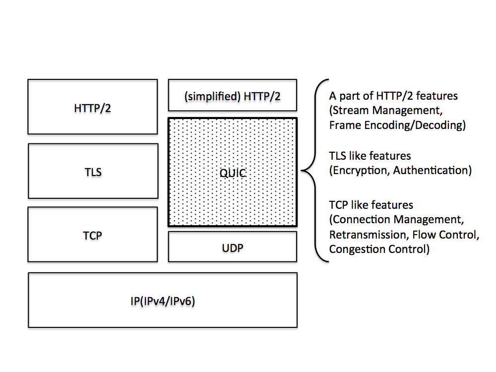
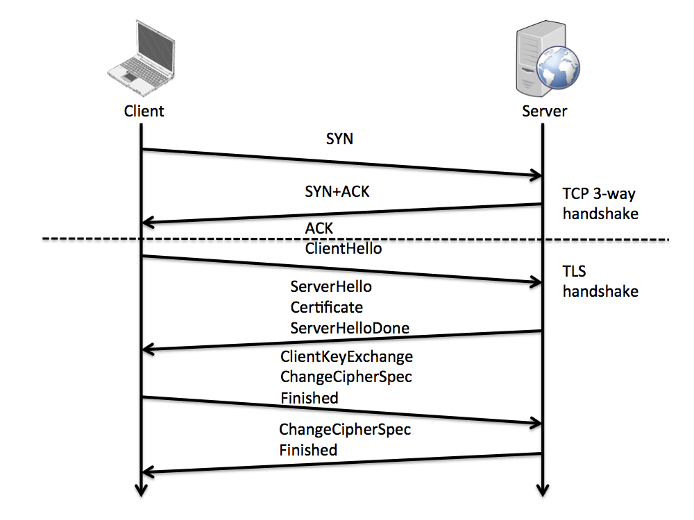
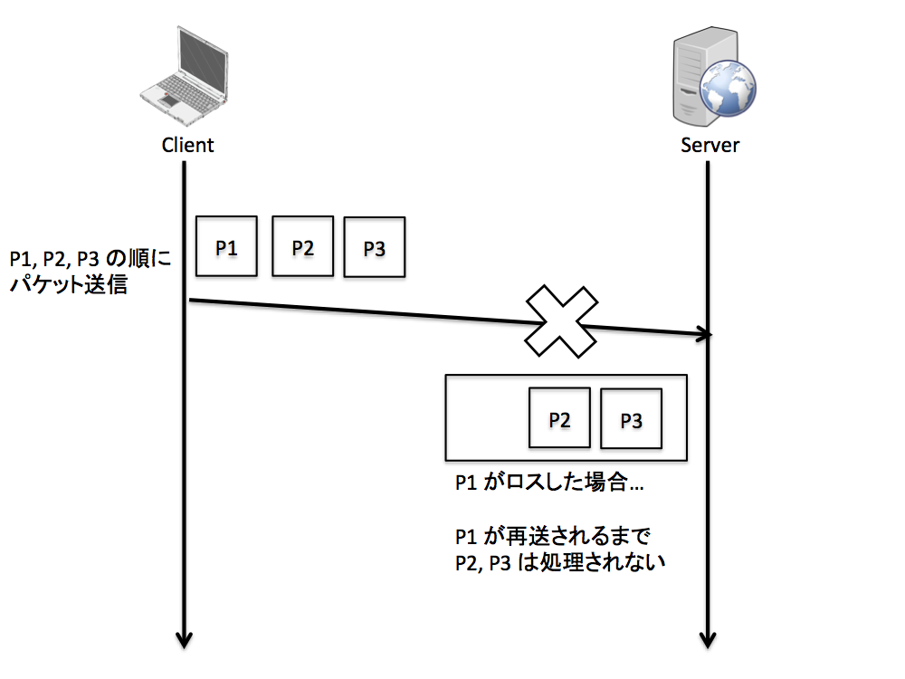
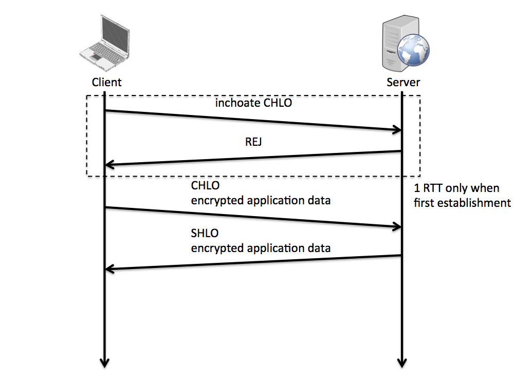
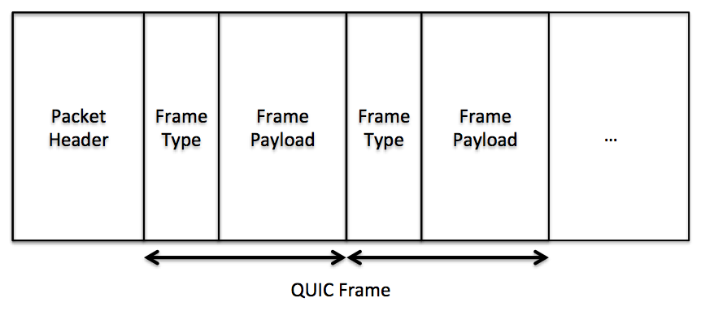
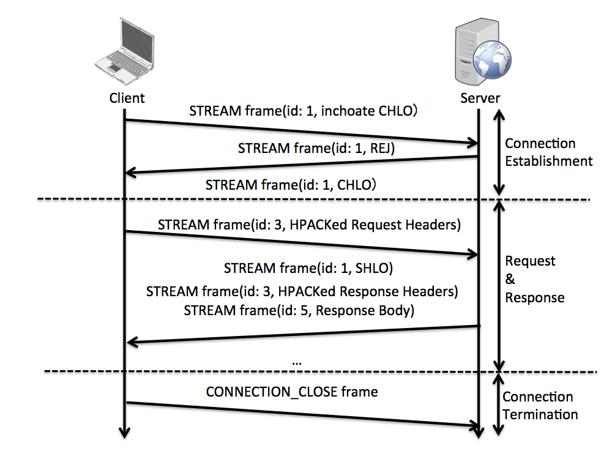

Title: SHOW BY QUIC!!
Subtitle: 青春はNon-(HoL)Blocking!
Author: @syu_cream
Author(romaji): syu_cream

# SHOW BY QUIC!!

こんにちは、 @syu_cream です。
本記事では、[ITMedia の記事](http://www.itmedia.co.jp/news/articles/1504/20/news046.html) などで一部界隈を賑わしている、 Google が提唱するプロトコル [QUIC(Quick UDP Internet Connection)](http://tools.ietf.org/html/draft-tsvwg-quic-protocol-01) について特徴や仕様などの簡単な紹介をしてみようと思います。

記事の内容には注意を払っておりますが、正確性が保証されているものではありません。
気になる箇所についてはぜひ、ご自身で仕様や実装を読んで確かめていただければと思います。
また、 QUIC は仕様がドラフトの状態であり、将来的に大きな変更がある可能性がありますのでご注意ください。

QUIC の詳細を理解するには、 HTTP の次期メジャーバージョンである HTTP/2 に関するある程度の知識が求められます。
重要な箇所については触れますが、詳細部分に関しては端折って記述しています。
詳細についてはぜひ [RFC7540(HTTP/2 の RFC)](https://tools.ietf.org/html/rfc7540) や、 [ななかINSIDE PRESS vol.5](https://sites.google.com/site/dai7sec/home/c86) を参照して確認して頂ければ幸いです。
なお、 HTTP/2 と、 HTTP/2 に関連するヘッダ圧縮フォーマット HPACK の RFC については、それぞれ有志による [RFC7540 の日本語訳](http://summerwind.jp/docs/rfc7540/), [RFC7541 の日本語訳](http://syucream.github.io/hpack-spec-ja/rfc7541-ja.html) が存在します。


## QUIC(Quick UDP Internet Connection) とは

QUIC(Quick UDP Internet Connection) は HTTP/2 から更に進んだ HTTP 通信の最適化を行うプロトコルです。
現在 2 個目の [Internet-Draft](http://tools.ietf.org/html/draft-tsvwg-quic-protocol-01) が出ている（番号上は 01 番）状態です。
ちなみに [QUIC のパケットロスからのリカバリと輻輳制御については別の Internet-Draft](https://tools.ietf.org/html/draft-tsvwg-quic-loss-recovery-00) が、 [ハンドシェイク部分については Google Docs にドキュメント](https://docs.google.com/document/d/1g5nIXAIkN_Y-7XJW5K45IblHd_L2f5LTaDUDwvZ5L6g/edit) がそれぞれ独立して存在する状態になっています。
また、 Chromium には既に QUIC が実装されています。（あなたが Google Chrome を使っているのであれば、既に QUIC を使っているかもしれません！）
Chromium における実装が気になる方は、 [Chromium のリポジトリ](https://chromium.googlesource.com/chromium/src.git/+/master/net/quic/) を参照してみるのも良いかもしれません。

そんな QUIC ですが、これは単純に HTTP/2 を置き換えるようなプロトコルではありません。
従来の TCP + TLS + HTTP/2 というスタックをやめて、 UDP 上に TCP + TLS で実現していたような高信頼性、セキュアな通信を担保し、ヵつ HTTP/2 で行っていた複雑なロジックを受け持つような設計になっています。
これにより TCP + TLS によって犠牲になっていた性能を向上し、かつことでアプリケーションレイヤの実装のシンプルにできます。
HTTP/2 との関係は下図のようになります。



さて、そもそも既存の TCP + TLS + HTTP/2 の世界ではなにが課題になっていて、 QUIC ではどのように解決されるのでしょうか。
まずはそこから追ってみましょう。

### HTTP/2 の特徴

[RFC7540](https://tools.ietf.org/html/rfc7540) では HTTP 通信を高速化するため、 HTTP/1.1 の次期バージョンとして HTTP/2 が提案されました。
HTTP/2 は HTTP/1.1 と同じように基本的に TCP, TLS の上に乗っかることを想定されています。

HTTP/2 は下記のような特徴をもち、 HTTP/1.1 より高速で柔軟な通信を実現します。

* ストリーム（論理的な通信単位）による並列リクエスト処理

HTTP/2 では原則的にサーバに対してコネクションを張り続けて、その上にストリームを張り、ストリーム毎にリクエストとレスポンスをやり取りすることになります。
HTTP/1.1 と比べコネクションが維持される状態が続き、コネクション確立の TCP の 3 ウェイハンドシェイクや TLS のハンドシェイクのレイテンシが削減できることになります。
また、一般的な Web ブラウザでは HTTP/1.1 を使用する際、サーバを配慮してコネクションを張りすぎないよう並列に投げるリクエスト数を制限しているのですが、 HTTP/2 ではこれと同等の制限は無くなるので並列度が上げられます。

なお、ストリームの概念の導入によりフロー制御は TCP で行っているものでは不十分な状態になります。
TCP のフロー制御はコネクション単位で行われるのでその上で張られる各ストリームに対する細かい制御は効かず、例えば特定のストリームだけが独占的に転送を行うような結果を招きかねません。
これを配慮して、 HTTP/2 では独自にストリームレベルでフロー制御を行えるような機能を持っています。

* 優先度付きリクエスト処理

HTTP/1.1 ではリクエストの優先順位を配慮してレスポンスを返すような機能はなく、多くの実装ではリクエストが来た順に処理されます。
HTTP/2 ではリクエストごとに重み付けや依存関係を記述することができます。
この情報を付与したリクエストをサーバに送ることで、サーバはクライアントが早めに欲しいレスポンスを見分けることができ、それらを優先的に処理するような実装が可能になります。

* ヘッダの圧縮

HTTP/1.1 までの HTTP のヘッダはプレーンテキストであり、 User-Agent のような毎回同じような値になるヘッダもリクエストごとに送ることになっていました。
HTTP/2 では [HPACK](http://tools.ietf.org/html/rfc7541) という独自のフォーマットでヘッダを圧縮します。
HPACK では下記のようなヘッダ表現を行い、ヘッダの転送量を削減します。

1. "User-Agent: " や "Accept-Encoding: gzip, deflate" など、よく使用されるヘッダの名前あるいは名前と値のペアをインデックスだけで指定できるようにする
2. 以前送ったヘッダを記憶し、インデックスだけで使いまわせるようにする
3. ヘッダの名前や値をハフマン符号化する

* サーバプッシュ

HTTP/2 ではサーバ側でクライアントが必要とする思われるリソースを能動的に送信することができます。
これにより、例えば「index.html に対するリクエストが来た際にそのページの表示に必要になる CSS も転送する」ような挙動が実現できます。
（しかしながら HTTP/2 の日本のコミュニティにより、サーバプッシュをうまく扱うのは難しく、前述の優先度を適切に処理する方が効果は高いのではとの指摘もされています。
サーバプッシュが気になる方は、 [@summerwind さんによるサーバプッシュの考察スライド](https://speakerdeck.com/summerwind/2-server-push-considered-harmful) を確認してみるとよいでしょう。）

### TCP + TLS + HTTP/2 の課題

HTTP/2 は既存の HTTP の性能向上のため多くの改良が入っています。
HTTP/2 はデプロイの容易性に配慮して、 TCP + TLS の上に構築されているのですが、 TCP + TLS を使うことで下記のような課題も残されています。

* セッション確立までに 3 ラウンドトリップ必要

ご存知の通り TCP + TLS では、下図のように TCP の 3 ウェイハンドシェイクと TLS のハンドシェイクにより、 HTTP 通信が可能になるまで 3 ラウンドトリップを要します。
TLS の Session resumption や False Start によってセッション確立までのラウンドトリップを減らすことができますが、それでも 2 ラウンドトリップは要します。



* TCP の HoL(Head of Line) ブロッキングによるパフォーマンス低下

ご存知の通り TCP ではパケットの到着順序が保証されており、送信された順に受信側でバッファから読み取れるようになります。
順序保証によって、より高レイヤでパケットの順序を意識しなくて済みます。
ただし、この順序保証によってパフォーマンスが阻害される場合もあります。

下図のように、あるパケットがロスし、それに続くパケットが受信側に到達した場合どうなるでしょうか。
この場合、ロスしたパケットが再送されるわけですが、再送が完了されるまでその後に続くパケットはバッファに蓄積された状態でアプリケーションには処理されません。
このようにパケットロスによってそれに続くパケットの処理がブロックされる問題を、 TCP の HoL ブロッキングと言います。



### QUIC が実現する世界

まずは QUIC の利点に着目してみます。
TCP + TLS + HTTP/2 の構成と比べ、 QUIC + HTTP/2 の構成では下記のような利点が生じます。

* コネクション確立のレイテンシが低い

前述の通り、 TCP + TLS では HTTP 通信が可能になるまで通常では 3 ラウンドトリップを要します。
これに対し、 QUIC では多くの場合コネクションの確立にラウンドトリップを要しません。

QUIC クライアントが QUIC サーバに対してはじめてリクエストを送る際、 1 ラウンドトリップを要します。
この際にクライアントは inchoate CHLO(Client Hello) メッセージを送り、それに対してサーバはコネクションを確立するのに必要な情報と共に REJ(rejection) メッセージを返します。
次回リクエスト送信時からは、 REJ メッセージで受け取った情報を CHLO メッセージに含ませ、それと一緒に暗号化されたリクエストを送ることで、コネクション確立のフェーズを無くすことができます。



* TCP の HoL ブロッキングのない通信の多重化

QUIC の解決する課題の中で個人的に一番インパクトがあったのがこの、 TCP の HoL(Head of Line) ブロッキングの解消です。

TCP + TLS + HTTP/2 では TCP の HoL ブロッキングが課題として挙がっていましたが、果たして QUIC ではこの HoL ブロッキングの問題はどうなっているのでしょうか？
と言っても答えは単純明快です。 QUIC ではそもそも TCP ではなく UDP の上に展開しているので、 TCP の HoL ブロッキングは起こりません。
（ちなみに、 TCP の HoL ブロッキングが無くなったからプロトコル処理で順序保証によるブロックする要素はもう無いんだ！という訳にもいきません。
後述しますがヘッダ処理周りでブロックされる可能性があります。）

余談ですが、 [shigeki_ohtsu さんによる、コネクション確立と、 HoL ブロッキングの解消によるインパクトを可視化した動画](https://www.youtube.com/watch?v=bP-8vfDX2ts) が youtube にて公開されています。
QUIC のこの周辺の効果を体感したい際に参照すると良いでしょう。

* コネクションマイグレーション

TCP のコネクションは送信元 IP とポート、宛先 IP とポートから識別されるため、例えば送信元 IP が変わった際は一旦コネクションが切れることになります。
これは例えばスマートフォンでモバイル回線から WiFi に切り替わった際に発生することになり、今日では非常に煩わしい問題だと考えられます。

QUIC のコネクションは TCP のコネクションとは違って、独自の 64 ビットの ID によって識別され、これが変更されない限りコネクションは切断されません。

またここに挙げた以外にも、 QUIC では TCP + TLS とほぼ同じような役割を持つ都合、これらのレイヤで融通の利かなかった部分を改良することができます。
例えば次のような点が挙げられます。

* 柔軟な輻輳制御アルゴリズム
* 再送処理の改善
* アプリケーションレイヤでのフロー制御の不要化

ただし本稿ではこれらの点については詳しくは触れません。仕様の Internet-Draft を参照してみてください。


## QUIC 詳解

ここではより QUIC の仕様に踏み込み、具体的にどのようなメッセージをやりとりし、その時なにが起きるのかを掘り下げていきます。

まず QUIC の大まかな特徴を確認し、次に QUIC におけるメッセージの単位であるパケットとフレームについて触れ、それらがどのようにやり取りされてリクエストやレスポンスが処理されるのかを追っていきます。
なお、ここでは単に「パケット」「フレーム」と記述した際は、 QUIC におけるメッセージ単位の「QUIC のパケット」「QUIC のフレーム」と解釈してください。

### QUIC の特徴

QUIC は下記のような特徴を持つプロトコルになっています。

* コネクションによる通信の管理

UDP はコネクションレスなプロトコルですが、その上で展開する QUIC にはコネクションの概念が存在します。
TCP ではコネクションを送信元 IP アドレス、送信先 IP アドレス、送信元ポート番号、送信先ポート番号で識別しましたが、 QUIC では各コネクションにランダムかつユニークな符号無し64ビット整数値で表現される ID で識別します。

* ストリームによるコネクション上の通信の多重化

QUIC でも HTTP/2 であったような通信単位であるストリームを持ちます。
ストリームの扱いとしては基本的に HTTP/2 のそれを踏襲していますが、各ストリームの処理は前述の通り TCP の HoL ブロッキングに阻まれることはないという差分もあります。

* フロー制御

QUIC のフロー制御は HTTP/2 のそれと同様に行われます。
すなわち、コネクションレベルとストリームレベルのウインドウサイズを持ち、後述の QUIC における WINDOW_UPDATE フレームで増加管理が行われることになります。
ここで着目したいのは、 TCP + TLS + HTTP/2 では TCP と HTTP/2 でそれぞれフロー制御を行っていたのが、 QUIC においては QUIC のレイヤでのみ行えば済むようになるので、機能的な重複が廃され、かつアプリケーションレイヤの実装がシンプルにできる点です。

* 前方誤り訂正 (FEC, Forward Error Correction)

QUIC ではパケットがロスした際になるべく再送せずに済むよう、前方誤り訂正を行う機能を持ちます。
これは仕組みは単純で、 RAID のパリティのような情報を持つことになります。

QUIC では幾つかのパケットを合わせて FEC グループという単位を作ります。
その FEC グループのパケットの XOR を取ったパリティを FEC パケットとして送信します。
これにより 1 パケットがロスした場合でも FEC グループのその他のパケットと FEC パケットを用いてそのパケットの復元が可能になります。
前方誤り訂正を使用するか（FEC パケットを送るか）は送信者が選択することができます。

* パケットの再送処理

QUIC では TCP のそれを改良したようなパケットの再送処理を行います。

QUIC のパケットは TCP のようなシーケンス番号を持ちます。
ただし受信データサイズを足し上げていく TCP とは異なり、 QUIC では「転送が開始した順に単純にインクリメントする」よう管理されます。

QUIC の再送処理は NACK を通知することで行います。
これにより、QUIC では TCP のような「ACK が来なかったら再送する」のではなく、「NACK が来たら再送する」形になります。
また、 QUIC では NACK をシーケンス番号のレンジで伝えることができ、パケットロスの通知も無駄なく行えます。
TCP でも SACK オプションを使うことである範囲のシーケンス番号のパケットのみ再送してもらうような制御が行えますが、この範囲は最大 3 つに限定されます。
対して QUIC の NACK は最大 255 個のレンジを伝えることができます。

QUIC の ACK は、後述する ACK フレームによって行われます。

### QUIC パケット

QUIC でやり取りされるメッセージにはまずパケットという単位があります。
QUIC のパケットにはヘッダとして下記の情報が付与されます。

* フラグ
* コネクション ID
* 使用する QUIC のバージョン
* シーケンス番号
* FEC グループ番号

QUIC のパケットは下記の 4 種類が存在し、フラグの内容によって識別されます。

* バージョンネゴシエーションパケット

使用する QUIC のバージョンを変更する際に使用されるパケットです。
実は現在の QUIC の Internet-Draft では詳細が記載されていないのですが、ここでは Chromium の実装を読んで筆者が把握した点を記述してみます。

バージョンネゴシエーションパケットには、後述する QUIC タグで表現される QUIC のバージョンのリストが含まれます。
パケットを受信してパケットのヘッダに含まれる QUIC バージョンを読み取った際に、それが自分がサポートしていない値だった時にこのパケットを送ってピアと使用バージョンをネゴシエーションできます。
（サポートしていないバージョンを想定して送られたパケットは再送されることになります）

* フレームパケット

QUIC の主要なメッセージ単位であるフレームを表現します。
フレームにもいくつか種類が存在します。
フレームパケットには複数のフレームが格納される可能性があります。



* FEC パケット

前述した前方誤り訂正に用いられるパリティを伝えるためのパケットです。
このパケットのペイロードには具体的には、 FEC グループのパケットのデータ（を必要に応じてパディングを加えたもの）の XOR をとったものが設定されます。

* Public Reset パケット

このパケットに関しても現在の Internet-Draft には詳細が記述されていません。
PRST という値の QUIC タグを設定しピアに送信するフィールドを持ちます。
現在の Chromium 実装では Public Reset パケットを受け取ったエンドポイントはコネクションを終了するようです。

### QUIC フレーム

QUIC も HTTP/2 と同様にフレームという形式でメッセージを表現します。
フレームには次に挙げる通りいくつかのタイプがあり、それぞれ役割が異なります。

* STREAM フレーム

ストリームに関するデータを表現するためのフレームです。
コネクションの確立やリクエストとレスポンスのヘッダ、ボディのやり取りにも使用されます。
HTTP/1.1 におけるリクエストやレスポンスのボディ、 HTTP/2 における最初の HEADERS フレームや DATA フレームの役割に相当します。

* ACK フレーム

TCP の ACK と似たような役割で、ピアに対してパケットが受け取れたことを伝えます。
ただし、前述のとおり TCP の ACK とは違って NACK による再送依頼を行う形になります。
複数のシーケンス番号のレンジを使った NACK を送ることもできます。
ACK フレームのペイロードには、受け取ったパケットの中で最も大きなシーケンス番号を伝えるフィールドや NACK のレンジのフィールドなどがあります。

* CONGESTION_FEEDBACK フレーム

このフレームは QUIC の Internet-Draft にその存在については記述されているのですが、詳細情報は今のところありません。
現状の Chromium 実装にも CONGESTION_FEEDBACK フレームを交わすような箇所は見当たりませんでした。
名前からしておそらく輻輳制御に関わる情報をピアに送るのに使用されるものと推測されます。

* PADDING フレーム

名前の通りパディングを示します。
PADDING フレームがある場合は、そのパケットのペイロードは末尾までパディングとして扱われます。

* RST_STREAM フレーム

基本的に HTTP/2 の RST_STREAM フレームと同じ役割です。
ストリームが不要になってキャンセルする場合や、エラーなどが原因でストリームを終了する場合にやり取りされます。

* CONNECTION_CLOSE フレーム

コネクションが閉じられようとしていることをピアに伝えます。
なお、コネクションが閉じられる際にはその上で動作している全ストリームも閉じられることになります。
もしこの時、データ転送など絶賛稼働中のストリームがあったとしても途中で強制終了されることになります。

* GOAWAY フレーム

基本的に HTTP/2 の GOAWAY フレームと同じ役割です。
近い将来にコネクションが閉じられようとしていることを伝える、 CONNECTION_CLOSE フレームと似たような役割を持つのですが、こちらはすぐにコネクションを閉じることはしません。
動作中のストリームはそのまま処理を続けることができます。ただし、ストリームを新たに開いたり受け付けたりすることはできなくなります。

* WINDOW_UPDATE フレーム

基本的には HTTP/2 の WINDOW_UPDATE フレームと役割は一緒で、フロー制御に使用されます。
ピアに対して、指定ストリームの受信ウインドウサイズが、送信する値の分だけ増加することを伝えます。
もしストリーム ID が 0 のストリームに対する WINDOW_UPDATE フレームを受信したら、それはコネクションレベルのウインドウサイズの増加であると解釈されます。

* BLOCKED フレーム

これは前述の WINDOW_UPDATE フレームとも深い関わりのあるフレームです。
データの送信側が、送信準備は整っているのに受信側のウインドウサイズが更新されず、送信処理がブロックされていることを伝えます。
とは言っても、 BLOCKED フレームが送受信された際になにかしなければならないという規定はありません。あくまでブロック情報を伝えるだけの、デバック用途のフレームといえます。

* STOP_WAITING フレーム

このフレームは ACK フレームや再送処理と関わりの深いものであるといえます。
プレームのペイロードに設定する、「最も大きな ACK がされていないシーケンス番号」より小さなシーケンス番号のパケットを待たないようにピアに伝えます。
ACK フレームで伝える NACK レンジを肥大化させないようにするなどの用途に使われるものと思われます。

* PING フレーム

ピアとの接続が使用可能な状態か確かめます。
PING フレームを受け取ったピアは ACK を返すことになっています。

### コネクションの確立

UDP はコネクションレスのプロトコルですが、その上で動作する QUIC にはコネクションの概念があります。
QUIC のコネクションはクライアントがサーバに対して接続要求を開始することで確立されます。

QUIC におけるコネクションの確立は、ID が 1 のストリームで QUIC の crypto handshake メッセージを交わすことで行われます。
crypto handshake メッセージでは QUIC タグと呼ばれる 4 バイトの値と、それに対応する値で様々な情報を表現します。
本稿での解説に必要な幾つかの QUIC タグとその役割を紹介します。

* CHLO: クライアントが最初に送るメッセージを示します。初めて通信するサーバとは一部パラメータの無い CHLO (inchoate CHLO) を送ることになります
* SHLO: CHLO の内容が問題なかった時にサーバが返却するメッセージを示します
* REJ: CHLO の内容に問題があるなどの理由からコネクションを確立することを断る場合に返却するメッセージを示します
* SCFG: サーバ設定を示します。 SCFG には鍵交換パラメータや暗号アルゴリズムなどの複数の情報が含まれます
* SCID: SCFG の ID を示します。 CHLO メッセージに含ませる必要があります
* STK: ソースアドレストークン（クライアント IP アドレスから生成されるトークン）を示します。 CHLO メッセージに含ませる必要があります
* SNO: サーバノンス（サーバで生成した乱数値）を示します。 CHLO メッセージに含ませる必要があります
* PDMD, CCS, CCRT: サーバ証明書の要求に関する情報を示します。ここではあまり深くは触れません
* CRT: 証明書チェーンを示します。クライアントが送った CCS, CCRT の内容に従って圧縮されます
* VER: 使用する QUIC バージョンを示します

crypto handshake メッセージには下記のような情報が含まれます。

* メッセージのタグ(CHLO, REJ など)
* メッセージに付随するタグのペアの数
* メッセージに付随するタグの名前と値のペア(STK とそれに対応する値など)

handshake メッセージによるコネクションの確立は下記のようなフローになります。

* 1. クライアントがサーバに対して inchoate CHLO(初期 CHLO) を送る

クライアントが CHLO を送ることでコネクションの確立処理が始まります。
CHLO メッセージではサーバ設定などの情報を付与することができるのですが、初めて CHLO を送る時点ではクライアントはそれらを持っていないので付与されません。
また、 VER と PDMD 、それに合わせてクライアントの持つ証明書に関する情報によって、 CCS, CCRT も付与されます。

* 2. サーバが REJ を返す

SCFG, STK, SNO を付与した REJ を返します。
CHLO の PDMD, CCS, CCRT の内容に従って CRT も付与します。

* 3. クライアントがサーバに対して CHLO を送る

サーバから受け取った STK, SNO と、SCFG を特定する ID である SCID、鍵交換パラメータ PUBS を付与します。

* 4. サーバが SHLO を返す

クライアントから受け取った CHLO に問題がなければ SHLO を返します。

ここまで実施すると、 QUIC のコネクションが確立されて暗号化された通信を行える状態になります。
コネクションを終了した後に再度コネクションを確立する際は、 STK, SNO, SCID 付き CHLO を最初から送ることでラウンドトリップなしにコネクションを確立できます。

### ストリームの管理

各ストリームは HTTP/2 のストリームの状態と同じく、 idle や open などの状態を持ちます。

ストリームにはそれぞれ ID が振られ、それによって識別されます。
ID の振られ方も基本的に HTTP/2 と同様でクライアントが開始した場合は奇数番号、サーバが開始した場合は偶数番号になり、それぞれ新たにストリームを開始する度に番号が増加されていきます。
ただしここで注意すべき点として、 HTTP/2 と異なり ID が 1, 3 番のストリームは特定用途のために予約されているということがあります。
ID が 1 番のストリームは crypto handshake に、 3 番のストリームはヘッダ用ストリームに使用されます。

### コネクションの終了

QUIC のコネクションは下記のどちらかの方法で終了します。

* 明示的な終了

CONNECTION_CLOSE フレームを送って終了する方法です。
CONNECTION_CLOSE フレームを送る前に、事前に GOAWAY フレームを送ってピアにコネクションを終了しようとしていることを伝え、アクティブなストリームの処理が完了するのをなるべく待つようにすることも可能です。

* 暗黙的な終了

タイムアウトにより終了する方法です。
QUIC のコネクションが idle な状態で一定時間（デフォルトでは 30 秒。最大 10 分に設定可能）経過したらコネクションが終了されることになります。
タイムアウトによるコネクション終了を行う場合でも、デフォルトではコネクションを終了しようとするエンドポイントは CONNECTION_CLOSE フレームを送ることになっています。


## QUIC と HTTP/2 の機能の住み分け

これまで追ってきた QUIC の機能ですが、そのいくつかは RFC7540 で規定されている HTTP/2 の機能と重複しています。
全く同じ機能を上位レイヤに持たせても無駄でありますから、 QUIC 上で動作する HTTP/2 は QUIC がカバーしてくれない仕事のみを行うべきです。

さて、 TCP + TLS が QUIC に置き換わった際、 HTTP/2 ではどんな処理を行う必要があるのでしょうか。

### ストリーム管理

HTTP/2 で行っていたストリーム管理は、 そのほとんどを QUIC のストリーム管理に任せることができます。
HTTP/2 のレイヤではもはや RFC7540 で記述されていたような、 HEADERS, DATA などのフレームによるヘッダ、ボディの表現を意識しなくてよくなります。
また、 HTTP/2 のストリーム ID としては QUIC のストリーム ID をそのまま用います。個別に HTTP/2 レイヤでストリーム ID 管理などは行いません。

フロー制御についても QUIC のレイヤで行われます。
QUIC のフロー制御は HTTP/2 のそれを機能的にカバーすることができ、 HTTP/2 のレイヤで再度行う必要はありません。
TCP + TLS + HTTP/2 では TCP と HTTP/2 、両方でフロー制御を行っていたのが一本化されるので、これは順当な置き換えと言えそうですね。

### ヘッダ圧縮

QUIC では HTTP/2 と同様、 RFC7541 で規定されている [HPACK](http://tools.ietf.org/html/rfc7541) を使用してヘッダを圧縮します。

しかしながら、実は HPACK を使用することで新たに HoL ブロッキングが発生することになります。
というのも、 RFC7541 を読めばわかる通り、 HPACK ではヘッダの圧縮、展開が順番に行われるためです。
例えばヘッダをデコード中、途中のヘッダ内容を格納するフレームがパケットロスにより失われたとしても、その後に続くヘッダをデコードすることは HPACK の仕様上叶わなくなります。

QUIC によるヘッダの送受信はヘッダストリーム（ID が 3 のヘッダ転送専用ストリーム）を用いて行います。
受信処理において、ヘッダの処理が終わってからボディの処理を行うことになります。

### ストリームの優先度とヘッダストリーム

HTTP/2 では 各ストリームに優先度を設定することができました。
これは例えばブラウザ側で Web ページのレンダリングを早く行うために CSS が優先的に求められると判断した際に、それを優先する旨をサーバ側に通知するなどに使うことができます。

QUIC ではストリームの優先度については特になにも行いません。
優先度情報を通知させる手段として、ヘッダストリームにおいてヘッダの先頭部分に優先度を設定することができます。
ただし、優先度をどう活用するかは HTTP/2 のレイヤに委ねられることになります。

ヘッダストリームに流れるオクテットストリームは下記のようなフォーマットをとります。

```
0            3     4            7    8           11     12
+--------+- ... ---+--------+- ... --+--------+- ... ---+------ ...
|     Priority     |    Stream ID    |  Headers length  | Headers
+--------+- ... ---+--------+- ... --+--------+- ... ---+------ ...

* Priority: 32 ビットの優先度値
* Stream ID: QUIC のストリーム ID に紐付いた HTTP/2 における 32 ビットのストリーム ID
* Header length: 32 ビットのヘッダの長さ
* Headers: HPACK で圧縮されたヘッダ
```

### Alternate-Protocol ヘッダによるプロトコルネゴシエーション

HTTP/2 では、クライアントがサーバに対してリクエストを送る前に、サーバが HTTP/2 に対応しているかを調べる方法として TLS の拡張である [NPN](http://tools.ietf.org/html/draft-agl-tls-nextprotoneg-04) や [ALPN](https://tools.ietf.org/html/rfc7301) を使ってネゴシエートすることができました。

QUIC ではどうなのかというと、今のところリクエストを送る前にピアが QUIC に対応しているかを調べる手段は提供されていません。
しかしながら TCP + TLS + HTTP でリクエストを受け付けた際に、「 QUIC でもレスポンスできる」ことを示す手段は QUIC の仕様に定められています。
それが Alternate-Protocol ヘッダです。

Alternate-Protocol ヘッダは下記のような形式をとります。
このヘッダは、ヘッダを返した際のリクエストのドメインに関して、「123 ポートで QUIC でリクエストを受け付けることができる」ことを意味します。

```
"Alternate-Protocol: 123:quic"
```

ただし、このヘッダで確認できるのはサーバ側でどのプロトコルをサポートしているかという情報だけです。
実際に QUIC を使う場合は、中継装置により QUIC （がベースとしている UDP の）通信がブロックされる可能性があるので、駄目だった際に TCP + TLS + HTTP 通信にフォールバックできるように実装されることが望まれます。


## QUIC による実際のリクエスト

### QUIC のコネクション確立、リクエスト処理、終了までのフロー

それでは、 QUIC において新規にコネクションを確立してからリクエストを送信し、レスポンスを受け取ってコネクションを終了するまでの処理の流れを見てみましょう。
（簡単化のため ACK, STOP_WAITING, WINDOW_UPDATE フレームなどのやり取りを省いて記述しています）


### Chrome で QUIC を体感してみる

Google Chrome には既に QUIC が実装されており、 QUIC に対応している Google のサーバにリクエストを投げることで QUIC をすぐに体験することができます。
Chrome のアドレスバーに chrome://net-internals/#quic と打ち込むと下図のように現在の QUIC セッションの情報が確認できます。



ここからさらに chrome://net-internals/#events の画面に遷移することでやり取りされている QUIC パケットやフレームを確認することもできます。


## おわりに

長々と QUIC の紹介をしてきましたが、いかがだったでしょうか？
個人的には TCP と TLS の仕事も受け持ちつつ HTTP/2 の一部機能も引き取る QUIC は非常に野心的なプロトコルであるという感想を抱きました。
一方、実装が非常に複雑かつ困難になると思われるので、 QUIC をサポートするサーバ、クライアントが数多く出現するかというとそういう事もない気もしてしまいます。

しかしながら、 QUIC のねらうところについては、 [QUIC FAQ for Geeks](https://docs.google.com/document/d/1lmL9EF6qKrk7gbazY8bIdvq3Pno2Xj_l_YShP40GLQE/edit) を見ると QUIC を通して TCP を緩やかに改良していくような意図も含まれているように読み取れます。
QUIC は Internet-Draft が出て間もない若いプロトコルですし、今後の動向が非常に気になるところです。

